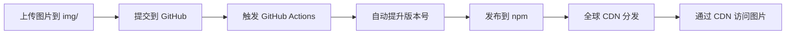

<div align="center">
  
  <p><strong>npm CDN 图床模板 - 供 Fork 使用的完整解决方案</strong></p>
  <p>
    
    
    
  </p>
</div>

## 📖 项目简介

这是一个用于创建个人图床的完整模板项目。通过 Fork 此仓库，你可以快速搭建属于自己的基于 npm CDN 的图床服务。项目集成了 GitHub Actions 自动化流程，每次提交图片后会自动发布到 npm，实现免费、稳定的图床服务。

## ✨ 特性

- 🆓 **完全免费** - 利用 npm 的免费 CDN 服务
- 🚀 **全球加速** - npm CDN 覆盖全球，访问速度快
- 🔄 **自动发布** - GitHub Actions 自动化发布流程
- 📦 **版本管理** - 每次提交自动升级版本号
- 🔒 **稳定可靠** - npm 作为全球最大的包管理平台，稳定性有保障

## 🎯 模板工作原理

1. **Fork 仓库**：Fork 此模板仓库到你的 GitHub 账户
2. **配置项目**：设置 npm token 和修改包名
3. **图片存储**：将图片放在 npm 包的 `img` 目录中
4. **自动发布**：提交代码到 GitHub 后，GitHub Actions 自动将包发布到 npm
5. **CDN 访问**：通过 unpkg、jsdelivr 等 CDN 服务访问图片

### 访问方式

当您完成配置并发布后，图片可通过以下 CDN 访问：

```
# unpkg
https://unpkg.com/[your-package-name]@[version]/img/your-image.png

# jsdelivr
https://cdn.jsdelivr.net/npm/[your-package-name]@[version]/img/your-image.png
```

> **注意**：将 `[your-package-name]` 替换为您在 `package.json` 中设置的包名，将 `[version]` 替换为具体的版本号或使用 `latest`。

## 🚀 快速开始

### 1. Fork 本项目

点击右上角 **Fork** 按钮，将本项目 Fork 到你的 GitHub 账号下。

### 2. 配置 npm Token

1. 登录 [npmjs.com](https://www.npmjs.com/)
2. 进入 **Access Tokens** 页面
3. 点击 **Generate New Token** → 选择 **Bypass 2FA** 类型 (npm最新规则token最长只能设置90天)
4. 复制生成的 token

### 3. 配置 GitHub Secrets

在你 Fork 的仓库中：

1. 进入 **Settings** → **Secrets and variables** → **Actions**
2. 点击 **New repository secret**
3. 添加以下 Secret：
   - Name: `NPM_TOKEN`
   - Value: 粘贴你的 npm token

### 4. 修改模板中的占位符

编辑 `package.json`，将包名改为你的自定义名称：

```json
{
  "name": "your-image-hosting-package",
  "version": "0.0.1",
  "description": "My personal image hosting solution using npm CDN",
  ...
}
```

**注意**：包名必须是 npm 上未被占用的唯一名称。同时记得更新描述文字以符合你的项目。

### 5. 上传图片

1. 将图片放入 `images` 目录
2. 提交代码：
   ```bash
   git add img/
   git commit -m "feat: add new images"
   git push origin master
   ```

3. GitHub Actions 会自动：
   - 提升版本号
   - 发布到 npm
   - 创建版本 tag

### 6. 使用您的图床

发布成功后，使用以下格式访问您的图片：

```markdown

```

在 Markdown 或 HTML 中都可以使用这些链接。

## 📁 项目结构

```
npm-graph-bed/
├── .github/
│   └── workflows/
│       └── publish.yml      # GitHub Actions 自动发布配置
├── img/                     # 图片存储目录
│   └── other/npm-pic.png
├── index.js                 # 包入口文件
├── package.json            # 包配置文件
└── README.md               # 项目说明
```

## ⚙️ 工作流程



## 💡 模板使用建议

1. **个性化定制**：Fork 后根据需要修改 README、描述等信息
2. **图片优化**：上传前压缩图片，减小包体积
3. **命名规范**：使用有意义的文件名，便于管理
4. **版本控制**：重要图片建议指定具体版本号而非 `@latest`
5. **包大小限制**：npm 包有大小限制，建议单个包不超过 100MB

## 🛠️ 模板自定义选项

### 可选配置

Fork 本模板后，您可以根据需要自定义以下内容：

- **项目名称**：修改 `package.json` 中的 `name` 字段
- **版本策略**：编辑 `.github/workflows/publish.yml` 中的版本提升命令
- **目录结构**：修改图片存储目录（记得同步更新 GitHub Actions 配置）
- **徽章链接**：更新 README 中的 npm 和 GitHub 链接指向您的项目

### 自定义版本提升策略

编辑 `.github/workflows/publish.yml`：

```yaml
# 补丁版本 (0.0.1 → 0.0.2)
npm version patch

# 次版本 (0.0.1 → 0.1.0)
npm version minor

# 主版本 (0.0.1 → 1.0.0)
npm version major
```

## 📝 注意事项

- ⚠️ **npm 包一旦发布无法删除**，版本号会永久保留
- ⚠️ **不要上传敏感信息**，npm 包是完全公开的
- ⚠️ **遵守 npm 使用条款**，不要滥用 CDN 服务
- ⚠️ **图片版权**，确保你有权使用并分发上传的图片

## 📄 License

ISC

## 📄 模板使用说明

此仓库是一个模板，用于创建个人图床项目。如果您发现了模板中的问题或想改进模板，请在原始仓库中提交 Issue 或 Pull Request。

原始模板仓库：[https://github.com/cosmium/npm-graph-bed](https://github.com/cosmium/npm-graph-bed)

---

<div align="center">
  <p>如果这个项目对你有帮助，请给个 ⭐️ Star 支持一下！</p>
</div>
